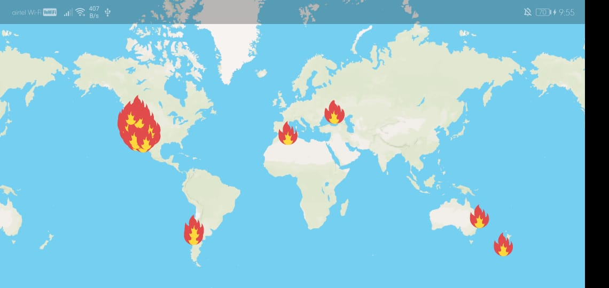

# Wildfire Tracker

> This is a Flutter app to track wildfires and plot them on a MapBox map.

## API Keys

You will need to add your MapBox API key in the Code and register for a NASA API key at https://api.nasa.gov.

## How it Looks

